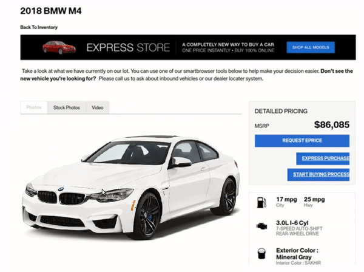

# Monocular Neural Image-based Rendering with Continuous View Control
This is the code base for our paper [**Monocular Neural Image-based Rendering with Continuous View Control**](https://arxiv.org/abs/1901.01880). We propose an approach to generate novel views of objects from only one view, with fine-grained control over the virtual viewpoints. With out method, one can view a single 2D Internet image as in 3D:




*Videos are generated by our method in real-time (20 FPS) folowing user's cursor. The only input is a single 2D image.*
## Prerequisites
- Ubuntu 16.04
- Python 3.6
- NVIDIA GPU + CUDA 8.0
- Pytorch 1.1.0

## Installation
- Clone this repo:
```bash
git clone https://github.com/xuchen-ethz/continuous_view_synthesis.git
cd continuous_view_synthesis
```
- Install dependencies.
```bash
pip install -r requirements.txt
```
## Interactive Demonstration
- Download a pre-trained model from our [Google Drive](https://drive.google.com/drive/folders/1yV-nq8EfM2cybk2ciRY5BL0mKeciqKqR?usp=sharing);
- Unzip the model under ``./checkpoints/`` folder;
- For interactive demonstration, run ``./demo_car.sh`` or ``./demo_kitti.sh``.
- In car demo, you can drag the image to move the car as in 3D.
- In KITTI demo, you can move by pressing ``w,a,s,d`` to move in the scene. After single-clicking the image, the viewing angle will change with the cursor.
- Note that the interactive demonstration only works within a certain movement range due to training data and dis-occlusions.

## Testing
- Dowoload and unzip pre-trained weights in the same way as for [interactive demonstration](#interactive-demonstration).
- Run ``./test_car.sh``, ``./demo_chair.sh`` or ``./demo_kitti.sh`` to run the demo.
The test results will be saved to `.gif` files and a html file here: `./results/car/latest_test/`.

## Training
- Download a dataset from our [Google Drive](https://drive.google.com/drive/folders/1YbgU-JOXYsGi7yTrYb1F3niXj6nZp4Li?usp=sharing);
- Unzip the dataset under ``./datasets/`` folder;
- Train a model by running ``./train_car.sh``, ``./demo_chair.sh`` or ``./train_kitti.sh``
- To view training results and loss plots, run `python -m visdom.server` and click the URL http://localhost:8097. To see more intermediate results, check out `./checkpoints/$name/`

## Citation
If you find this repository useful for your research, please consider citing our paper.
```
@article{chen2019mono,
  title={Monocular Neural Image Based Rendering with Continuous View Control},
  author={Chen, Xu and Song, Jie and Hilliges, Otmar},
  year= {2019},
  booktitle = {International Conference on Computer Vision (ICCV)},
}
```

## Acknowledgments
Code is based on [pytorch-CycleGAN-and-pix2pix](https://github.com/junyanz/pytorch-CycleGAN-and-pix2pix.git) written by [Jun-Yan Zhu](https://github.com/junyanz) and [Taesung Park](https://github.com/taesung89) and [SfmLearner-Pytorch](https://github.com/ClementPinard/SfmLearner-Pytorch) written by [Clément Pinard](https://github.com/ClementPinard).
